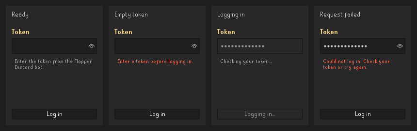

# Login interaction and feedback

The login form previously used a clickable label. Keyboard users could not submit it, an empty token reached the consent dialog and authentication service, and repeated clicks could start overlapping requests. A pending request left no visible progress. Failures opened a generic modal dialog without helping the user retry.

`TokenLoginForm` owns the entry, pending and failure states. Enter in the token field or Enter/Space on the button submits the form. Empty input stays local. An accepted confirmation disables the controls until the request completes, including when the request fails synchronously. A failure restores the controls and provides an inline retry message without displaying server details. The password field masks the token, and success clears its contents.

The existing confirmation about sending GE transactions and the IP address to Flipping Utilities is preserved, including its default **No** choice. The form receives the confirmation and authentication callbacks from `LoginPanel`; it does not own token persistence or API policy. Membership retry, membership management and sign-out now use real buttons. Sign-out retains its confirmation and clears the logged-in view flag.

The image uses the production form and RuneLite's look and feel. `TokenLoginFormPreview` in the test source set renders these states using controlled futures; run its main method with the test runtime classpath and `-Djava.awt.headless=true`. It defaults to `build/ui-preview/login-form-states.png`, or accepts a PNG destination as its first argument. No credentials or network connection are needed.

Four tests cover empty input, declined consent, keyboard submission, duplicate pending submission, asynchronous failure, retry, synchronous failure, success cleanup and accessible token/button semantics. The full branch suite passed with 158 unique tests and one optional private-data fixture skipped. Live authentication and assistive-technology behavior still need a RuneLite session check.

The separate component gallery adds a reusable workbench for component states. This form's callback boundary allows it to be added there with synthetic pending and failed futures. The health-polling executor owned by `LoginPanel` still needs lifecycle cleanup in the broader plugin lifecycle work; this change does not alter scheduling or service subscriptions.
