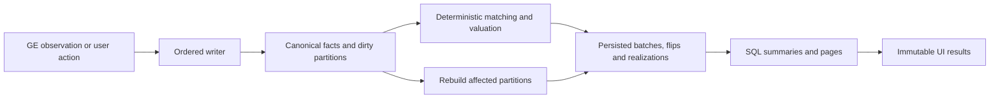

# Persisted flips, profit, and SQL reporting

Planning only. Stacked on [SQLite migration PR #84](https://github.com/Flipping-Utilities/rl-plugin/pull/84), `fix/sqlite2-audit`, at `3c2df744b1cf8b64863b1eed7ddeb0966537e139`. No schema or runtime changes are implemented by this document. Domain terms are defined in [CONTEXT.md](../CONTEXT.md).

## Direction and confirmed requirements

Persist the source observations, compute new-mode matching when trading data changes, and persist the resulting flips, allocations, and financial amounts. New-mode reporting should select, aggregate, sort, and paginate those amounts in SQL. Opening a new-mode panel or changing its period must not run the matching engine again. Exact legacy reporting is an explicitly isolated compatibility path.

**Confirmed for the new accounting method:** recognize profit when a sale happens, using an eligible purchase's cost even if the purchase was earlier. Buying for 100 yesterday and selling for 120 today recognizes 20 today before tax. Report date filters apply after matching; opening-inventory eligibility is a separate migration decision.

**Scope requested for this stacked PR:** assume SQLite is authoritative and JSON has been removed. JSON import, dual writes, backend selection, and JSON removal belong to the underlying storage work and are out of scope here. “Old/new format” means old/new accounting behavior inside SQLite, not a storage-file choice.

**User choice is required:** keep legacy accounting, recalculate history with the new method, preserve legacy reporting until a chosen cutover then use the new method, or start clean from a chosen date. Let users set an opening-purchase cutoff and confirm what stock to carry forward. Do not force historical recalculation or infer bank inventory from old GE purchases.

The single-initial-schema preference still applies if the combined schema has never shipped. Because this is a separate stacked change, an already released SQLite layout requires a numbered SQLite-to-SQLite upgrade; it must not be silently redefined as version 1.

Other accounting choices below are recommended defaults for implementation, not additional user confirmations. In particular, preserving margin-check priority, disallowing future purchases as sale basis, and allocating recipe costs across output sales must have explicit fixtures before shipping.

The implementation should use a deterministic Java matching engine and SQL reporting. Moving matching into a large recursive SQL query would complicate corrections and recipe reservations without solving a reporting requirement.

## Why the current design needs to change

| Current code | Limitation | Planned replacement |
| --- | --- | --- |
| [SqliteSchema](../src/main/java/com/flippingutilities/db/SqliteSchema.java), [SqliteStorage](../src/main/java/com/flippingutilities/db/SqliteStorage.java) | `trades` stores offer snapshots and scalar mirrors; ordinary flips and profit are not stored. Loading still hydrates entire histories. | Normalized source records and persisted financial projections; bounded reporting queries. |
| [HistoryManager](../src/main/java/com/flippingutilities/model/HistoryManager.java), `getIntervalsHistory`, `getFlips`, `combineToFlips` | Offers are filtered before matching; buys and sells are separately sorted, permitting a later purchase to fund an earlier sale. | Lifetime, account-local matching; date filtering on sale realizations. |
| Same class, `getProfit` versus `createFlips` | Summary profit and flip rows use different allocation rules. Flip rows reserve margin checks first; summary arithmetic does not. | One persisted calculation supplies rows, totals, sorts, and profit exports. |
| [Flip](../src/main/java/com/flippingutilities/model/Flip.java), [FlipPanel](../src/main/java/com/flippingutilities/ui/statistics/items/FlipPanel.java) | Rounded average prices are used to reconstruct profit, including an `int` multiplication. | Persist exact totals over recorded source amounts; averages are display values only. |
| [OfferEvent](../src/main/java/com/flippingutilities/model/OfferEvent.java), `fromGrandExchangeEvent` | UUID identifies a cumulative snapshot; a later snapshot replaces its predecessor. Cumulative money is divided into an average, saturated to `int`, and not serialized. | Stable offer identity, retained observations, raw 64-bit money, explicit corrections. |
| [RecipeHandler](../src/main/java/com/flippingutilities/controller/RecipeHandler.java), [RecipeFlip](../src/main/java/com/flippingutilities/model/RecipeFlip.java) | Recipe reservations affect ordinary matching across all history; financials are recomputed from embedded snapshots. | Persist user selections and their provenance; materialize recipe financials and reconcile affected ordinary flips together. |
| [StatsPanel](../src/main/java/com/flippingutilities/ui/statistics/StatsPanel.java), [FlippingItemHandler](../src/main/java/com/flippingutilities/controller/FlippingItemHandler.java) | Latest base commits precompute sort keys once, but rebuilds still scan and calculate over histories on the EDT. | Immutable SQL results delivered asynchronously to the UI. |
| SQLite source history | Unmatched purchases can represent items consumed or disposed of outside the GE. | Explicit opening inventory, a purchase cutoff, and a migration preview. |

Legacy history cannot reveal deleted intermediate observations, original execution times, averaged-away remainders, or saturated amounts. The migration must preserve and label that limitation rather than claim to reconstruct exact executions.

## User-selectable accounting migration

### Four modes, all using SQLite

Choose per account, with a bulk action that previews each account independently. Existing accounts stay on legacy accounting until the player applies a reviewed choice. New empty accounts can default to the new method. Saving a preview must not change active reports.

| Choice shown to the player | Historical reporting | Subsequent activity and opening inventory |
| --- | --- | --- |
| **Keep current calculations** | Retain the existing offer-filtering and matching behavior, including its known limitations. | Continue legacy calculations from SQLite sources. Richer source capture can continue without changing displayed results. |
| **Recalculate all history** | Build sale-time facts over all selected retained history; show differences before applying. | Continue the new method. No cutover inventory is fabricated; full replay accounts for prior sales and recipes. A purchase cutoff requires a dated start scope instead of silently changing “all history.” |
| **Keep history, switch from a date** | Freeze the legacy source view through cutover `T`; reports before `T` keep legacy calculations. | New facts recognize sales at or after `T`. Default opening inventory is empty; optionally carry reviewed purchases under the rules below. “Switch now” resolves `T` once when preparing the preview. |
| **Start fresh from a date** | Earlier history remains available in an archive but contributes nothing to the new ledger's totals. | New calculation begins at `T`, with empty opening inventory by default. Optional reviewed carry-in is clearly distinguished from a completely empty start. |

The last two choices share the same new accounting engine; they differ in whether earlier legacy reporting is shown alongside it. A custom date or selected carry-in quantities are parameters, not more independent modes. New-mode sale-time recognition remains the rule in every choice that uses the new method.

**Exact legacy results cannot be flattened into one additive fact table.** The legacy engine filters offers before matching, so different periods can assign different cost basis; its summaries and flip rows also use different rules. Keep a versioned `LegacyReportingAdapter` reading SQLite and cache results by account, exact bounds/filter, source revision, and calculator version. Run it off the EDT. Do not relabel a one-time all-history calculation as an exact legacy report for every period.

For a period spanning cutover, return two labeled segments: legacy results before `T` and new sale-time results at/after `T`. Apply the old interval rules within the frozen legacy source view and half-open bounds for the new segment; observations exactly at `T` belong only to the new segment. Show a combined money subtotal only with its mixed-method label and completeness; never imply it has the new method's additive semantics. ROI, profit/hour, counts, and exports remain segmented unless their combination is explicitly defined. Account-wide reports must also label/segment differing account policies. Do not sum distinct counts or average segment ROIs into a misleading total.

Freezing means preserving the pre-cutover source membership and revisions, recipe declarations, and legacy calculator version, not precomputing every possible report. A later correction does not silently rewrite that legacy segment. A player can deliberately create and preview a replacement migration plan to restate it. Capturing new observations continues regardless of the selected reporting mode.

### Purchase cutoff and opening inventory

Two dates answer different questions: `T` starts new accounting; `P` is the earliest purchase eligible to carry into it. Offer **no previous purchases** (recommended), **purchases in the preceding 7/30/90 days**, and **a custom earliest date**. Resolve a preset once to a persisted instant; it is not a moving expiry rule. Require `P <= T` and include purchases in `[P, T)`. Purchases from `T` onward follow normal new matching.

1. Reconcile the complete pre-`T` history first, including sales and recipe consumption before `P`. The cutoff filters remaining opening candidates after reconciliation; it must not erase sales or reset a partially consumed purchase to its original quantity.
2. Candidate quantities must have known source identity and supported cost, be unconsumed under both the frozen all-history legacy summary allocation and the legacy margin/flip-row allocation, and not be deleted or reserved to frozen/boundary-conflicted recipes. A wholly new-side recipe may carry its verified inputs only as an explicitly selected reservation bundle, subject to the same cutoff and cost checks. Their conservative intersection defines carry-in eligibility; if segments cannot be reconstructed reliably, exclude the disputed lot/item and explain why. Quantity confirmation alone cannot establish that a previous report did not spend that basis. Never take the same cost once in preserved legacy profit and again in new profit. A deliberate full recalculation can resolve the history using one new policy instead.
3. Show candidates grouped by item with purchase dates, available quantity, estimated/observed cost, and reasons for exclusion. The player confirms, reduces, or excludes quantities they still own; defaulting to every unmatched historical buy would recreate the stale-inventory problem. Never increase a source-backed quantity above its validated remainder or silently create a zero-cost opening lot.
4. Selected quantities create explicit opening lots linked to original purchase segments and the migration plan. They carry supported historical cost into the new period but create no purchase activity or profit at `T`. Their opening availability is `T`, their acquisition date remains the original date, and later period filters do not re-evaluate the cutoff.
5. Purchases older than `P`, missing purchase dates, and excluded remainders stay archived with their exclusion reasons. Exclusion means “not eligible as tracked trading stock,” not proof of consumption and not deletion. A future sale without an eligible basis stays visible with unknown profit. Known zero cost remains distinct from missing cost.
6. Full-history recalculation replays the complete source history and applies no opening cutoff. To exclude earlier purchases while using the new method, choose a dated new ledger and reviewed opening inventory. Do not use a rolling age limit that changes past profit when the plugin is opened later.

Examples, before tax:

| History and choice | Expected migration result |
| --- | --- |
| Buy 100 units a year ago, possibly consumed; start fresh today with no carry-in | None become opening stock. Selling 5 tomorrow has unknown basis unless new eligible purchases exist. |
| Buy 10 at 100 five days before `T`; sell 6 before `T`; use a 30-day purchase cutoff | At most 4 are opening candidates, at total cost 400. If the player confirms only 2, opening cost is 200. |
| Buy at 100 before `P`, then sell at 120 after `T` | Sale proceeds 120 are retained; profit is unknown, not 120 and not an invented 20. |
| Confirm an eligible purchase at 100, then sell at 120 after `T` | New-period profit is 20. Carrying the item itself realizes no profit. |
| Apply a 30-day cutoff, then reopen the plugin 60 days later | The chosen opening lot remains eligible; the cutoff does not slide forward. |
| A buy is used by the frozen legacy calculation but unused by another old view | Exclude it as ambiguous carry-in rather than spend its basis twice. |

### Boundary cases and applying the choice

- Capture a stable source revision and cumulative baselines for active slots at `T`. Split known observed fill batches across the boundary without replaying the pre-`T` cumulative quantity as new activity. An order already partially filled can continue across `T`; a changed slot is a new order. If an observation spans `T` without enough timing/value detail, disclose the aggregate ambiguity and do not guess a precise split.
- Treat recipes as indivisible migration reservations. Include in the frozen legacy side only declarations recorded before `T` whose selected sales are also before `T`. Recipes with sales at/after `T` use new accounting only when their inputs are eligible new purchases or explicitly reserved opening segments. Output sales on both sides, or a declaration recorded after `T` that claims earlier sales, are boundary conflicts: quarantine those reservations from ordinary allocation/carry-in and expose the new-side sales once with incomplete profit. The player may choose an earlier `T` or explicitly reconcile the grouping; never charge costs twice or silently move sale dates. Apply the purchase cutoff to recipe inputs too; an embedded old purchase is not an eligibility bypass.
- Freeze the legacy view at the reviewed revision. A late-arriving historical observation, correction, recipe edit, or deletion that touches frozen sources must trigger a previewed replacement plan or an explicit historical amendment; ordinary future commands must not mutate frozen reporting silently. A correction that invalidates carried basis marks the linked new projection incomplete and requests reconciliation rather than retaining known-wrong profit.
- Preview reports must show old/new totals for representative periods, the exact method/bounds, matched and unknown quantities, carry-in quantities/costs, excluded old purchases, missing data, recipe conflicts, and expected rounding/tax differences. A start-clean preview must clearly show that historical data is retained.
- Apply under an ordered writer barrier: verify the preview's source revision, replay activity captured since that revision or invalidate/recompute the preview, and publish the policy plus projections atomically. Persist stable command IDs and the cutover checkpoint. A second application of the same plan is a no-op.
- Store an immutable versioned plan containing account, mode, `T`/`P`, selected opening segments, source/calculator versions, preview digest, and activation revision. Switching or changing the cutoff creates a new candidate plan over preserved sources and switches one active pointer after verification; never destructively reset history. Reports/caches/cursors include the plan version.
- Reverting reporting means selecting/rebuilding a prior compatible plan against retained source history, with a preview of activity added since then. It must not restore an old database over newer writes or enable two plans' facts in one total. A frozen historical plan remains available for comparison even when it is no longer active.

## Accounting contract

The contract below applies to the new method. Legacy mode retains its compatibility semantics; hybrid mode exposes each segment's method explicitly.

### Recognition, ordering, and matching

1. Match within `(account_id, accounting_plan_id, item_id)` across the plan's eligible history and opening lots, before filtering any report period. Account-wide new-mode reports sum account-local results; they never share inventory between accounts or plans.
2. Reserve explicit recipe quantities first. Preserve the current margin-check priority as `margin_then_fifo_v1`: pair eligible whole one-unit checks with buy time no later than sell time and a gap below 60 seconds; then match remaining eligible quantities FIFO. Preserve the current completed-state and tick eligibility rules. A newly discovered pair can require replay of earlier provisional allocations.
3. Recommend causal matching: a purchase must precede a sale in the persisted ordering to supply its basis. A later purchase does not repair an earlier unbacked sale. Importing an actually earlier purchase can repair it through reconciliation. This intentionally changes existing behavior, including an expectation in `HistoryManagerTest`.
4. Order by effective observation time and a persisted sequence for ties. Retain source list order for legacy timestamp ties. Do not use randomly generated UUID order. For uncertain cross-offer timing, expose that quality rather than invent execution precision.
5. Recognize each sold portion at its sale batch's timestamp. New live batches use the time observed; offline fills may have happened earlier and must be labeled accordingly. Legacy cumulative snapshots produce one synthetic aggregate batch at the surviving snapshot's time. Missing historical time stays missing, with a separate import timestamp.
6. Use UTC instants and half-open reporting bounds `[from, to)`, resolved once per request. “All” also includes undated history with a disclosed count; dated periods exclude undated facts and disclose them. Preserve account/session start selection and define calendar periods in the selected display timezone, including DST boundaries.
7. A stable flip header groups a sell offer's batches; a margin pair has a distinct margin-check group. **Money belongs to dated realization rows, not the header's latest timestamp.** A partial sale today must not move yesterday's profit into today.
8. Keep offer completion and basis completeness separate. A completed sell can have unknown basis; a still-open sell can already have realized profit. Persist unmatched sold quantities and known proceeds instead of omitting them or assuming zero cost.

Example fixtures, ignoring tax:

| History | Expected new result |
| --- | --- |
| Buy 1 for 100 yesterday; sell 1 for 120 today | Today: cost 100, proceeds 120, profit 20. Yesterday: no realized profit. |
| Buy 2 for a total of 201; sell both for 300 | Cost 201, profit 99. A displayed average of 100 must not produce profit 100. |
| Buy 2 for 200; one sell offer fills 1 for 120 Monday and 1 for 130 Tuesday | Monday profit 20; Tuesday profit 30; one ordinary flip header, two dated realizations. Separate sell offers would have separate headers. |
| Sell 1 for 120 Monday; buy 1 for 100 Tuesday | Monday proceeds 120 with unknown basis/profit. Tuesday purchase remains available. |
| Only 1 bought unit is known; 2 units sell for 240 | Persist a matched portion and an unknown-basis portion. Show the known subtotal and incomplete status. |
| Account A buys; account B sells the same item | B's basis remains unknown. |

### Amounts, tax, and precision

- Store GP totals as Java `long` / SQLite `INTEGER`: acquisition cost, gross proceeds, tax, net proceeds, other cost, and profit. Use checked addition/subtraction; use overflow-safe intermediates for multiplication and allocation. An overflow is a reported calculation failure, never wrapping or silent conversion to floating point.
- Persist `net_proceeds = gross_proceeds - tax` and `profit = net_proceeds - acquisition_cost - other_cost` when the operands are known. Store missing amounts as `NULL` with reasons. Known zero is valid. Keep precision such as `observed_total`, `legacy_average_estimate`, and `modeled_tax` separate from whether a calculation is complete.
- Verify RuneLite's cumulative monetary fields for buys and sells before defining the capture adapter: whether values are gross or net, their width, and behavior on restart/cancel. Do not infer semantics from the name `spent`. Capture raw values before division or saturation. An observed aggregate with mixed prices may still be insufficient to derive exact per-unit tax.
- Version the tax policy from [GeTax](../src/main/java/com/flippingutilities/utilities/GeTax.java), [Constants](../src/main/java/com/flippingutilities/utilities/Constants.java), and `OfferEvent.getPrice`. Cover historical boundaries, exemptions, rounding, and caps. Retain legacy compatibility arithmetic for imported estimates; use integer arithmetic for new rule calculations where validated. Do not apply today's rate to all past sales.
- Split a known batch total deterministically. For a batch of quantity `Q` and total `T`, a quantity segment `[a, b)` receives `floor(T*b/Q) - floor(T*a/Q)` using overflow-safe intermediates. Assign stable segment order and preserve it on replay. Allocate primitive cost, gross proceeds, tax, and other cost this way; then derive each segment's net proceeds and profit. Independently rounding net/profit as well can break the per-segment equations. This conserves totals; it does not claim individual units actually traded at those allocated prices.
- Summary responses carry known subtotals, missing-amount counts/quantities, and estimated-amount counts. A complete profit is available only when all included profit amounts are known. Unknown costs must not hide known proceeds or tax.
- Distinguish **trade tax** on all recorded sold units from **tax allocated to realized flips**. The former includes unmatched sales. Calculate it from sale batches once, so recipe classification cannot double-count it.

### Recipe flips

Keep recipe selections as explicit user intent. Creating a recipe can take quantities previously assigned to automatic ordinary flips; deleting the recipe releases them. Preserve account-local matching and replay all affected items when this changes.

Persist the recipe instance's own UUID, recipe key and definition/version snapshot, declared execution count, component quantities, coin cost, and `recorded_at`. The current account/key/timestamp natural key must not merge two legitimate recipes created in the same millisecond. Editing a reusable recipe definition must not rewrite historical instances.

Legacy definitions and execution counts may be reconstructed heuristically: `getRecipeCountMade` infers from outputs, and synthesized definitions can assume unit quantities. Preserve their provenance, with nullable/estimated counts and definition confidence; do not label them declared facts. The current UI also permits a signed coin offset. Preserve a negative legacy coin adjustment as a signed adjustment with provenance, or mark it unresolved if its meaning is unclear; never clamp it or reject the entire import. Validate the proposed new-entry policy separately.

Recommend recognizing recipe profit at its selected output sales, with the recipe's input cost and coin cost allocated proportionally to the gross proceeds of those outputs. Use stable ordering and the same conserving remainder rule, splitting input cost and coin cost separately. If every output has a known zero value, assign the costs to the last output sale under that ordering. If required output values or input costs are missing, expose incomplete recipe profit; do not distribute an invented zero. This allocation is a reporting convention, and must be documented in recipe details.

This differs from today's recipe-creation-time reporting. Within the active new accounting scope, adding a recipe later reclassifies ordinary and recipe profit at the original sale dates; it does not create new proceeds on the day the user records it. Frozen legacy scope follows the explicit amendment rules above. Retain recipe-level attribution by instance/key, while storing actual component item IDs for lineage. Ordinary item summaries and recipe summaries must have explicit kinds so recipe profit is not also counted as an ordinary flip. The old parent-item description in `RecipeFlip` is not a current persisted field and must not become an import requirement.

Component references must preserve their original UUID and embedded snapshot. A detached recipe snapshot may prove a recipe cost without creating freely available ordinary inventory. When a snapshot conflicts with the current source, retain both and mark the conflict for reconciliation; do not quietly replace historical quantities/prices. For a referenced aggregate observation, distribute consumption over its eligible batches deterministically, retaining the mapping. Missing references and over-consumed legacy records remain visible as unresolved records. Reject new over-allocation atomically.

Detached output snapshots can also prove proceeds and tax. Represent their consumed segments as restricted recipe-evidence batches, resolving aliases against ordinary history first. Only reserved segments contribute to activity/tax reports, once per source segment; do not count an unreserved remainder or a duplicate normal-history batch. Deleting the recipe removes that derived contribution without creating ordinary inventory from detached evidence.

Keep current explicit offer-deletion behavior: delete referencing recipe instances as well. Collect every affected component's account/item **before** deletion, including other items in a multi-item recipe. For an active partial offer, recommend suppressing only the deleted quantity segments while retaining the cumulative baseline for continuity: deleting a partial quantity of 5, followed by an update to 8, makes only the new 3 reportable. Record the suppression boundary and provenance so replay, corrections, and import cannot resurrect the deleted 5. A whole-order suppression rule would be a different explicit product choice.

### Report metrics

- Ordinary units sold, units with known basis, and distinct ordinary flip groups are different metrics. A group with sales in two periods can appear in both periods' distinct counts; those counts are not additive.
- Count margin checks explicitly and make the inclusion policy match labels/tooltips. Profit includes them unless the user chooses a filter.
- Keep recipe instance count and recipe execution count separate from output-unit count. For period execution counts, recommend counting the declared executions once at the final output sale; profit can be recognized across several periods. Show this basis in the label/help text.
- Raw bought/sold quantities and values are activity metrics from fill batches, before recipe reclassification. They are not calculated from matched flips. Unfilled requested quantities are not filled activity.
- Compute ROI from aggregate profit divided by aggregate invested cost, including recipe coin cost where applicable; never average row ROIs. Zero/unknown denominator is unavailable. Retain tracked session duration for profit/hour, without treating purchase-to-sale wall time as active trading time.

## Target storage model

Names below are proposed logical tables, not final DDL. Keep source facts sufficient to rebuild derived rows, but avoid maintaining competing sources of financial truth.

| Table/group | Authority | Essential fields and purpose |
| --- | --- | --- |
| `accounts`, account aliases | Canonical | Stable internal ID; display name and optional known player identity. Preserve verified alias mappings across renames; do not guess continuity from names or invent an unavailable player ID. |
| `accounting_plans`, account reporting state | Canonical user intent | Immutable plan ID/version, account, mode, cutover, purchase cutoff, source/calculator versions, preview digest and activation checkpoint; one active plan pointer per account. |
| `opening_selections`, frozen source memberships | Canonical user intent/evidence | Selected original quantity segments, cost provenance, exclusions and suppression reasons, reserved recipe carry-in, and frozen legacy observation/recipe revisions. Preserve these independently of rebuildable allocations. |
| `offer_orders` | Canonical identity/current state | Stable order UUID, account, item, side, slot generation, continuity status, latest observation, visibility/deletion state. Slot number alone is not identity. |
| `offer_observations` | Canonical | Observation UUID, order ID, predecessor, ingest sequence, observed/effective timestamps, tick/session, cumulative quantity, nullable raw monetary total, legacy average price, listed price, state, source/provenance. Retain superseded observations and explicit correction links. |
| `source_aliases`, import mappings | Canonical | Account-scoped legacy UUID to observation/order mapping, source hash and record ordinal, stable IDs for UUID-less imports. Detached recipe snapshots have restricted recipe-only scope. |
| `recipe_flips`, `recipe_components` | Canonical | Stable instance/component IDs, definition snapshot, input/output role, referenced observation and original snapshot, amount consumed, coin cost, recorded time, resolution state. |
| `active_slots`, `ge_limit_state`, favorites, visibility, settings | Durable operational state | Slot order/observation pointers and continuity; account limits, local recipe definitions and user preferences already supplied by the SQLite storage layer. |
| deletion/correction records | Canonical | Command ID, targeted source/recipe, revision and intent, sufficient to prevent a projection rebuild or stale import from resurrecting deleted history. Can be columns/records alongside sources; no generic event framework required. |
| `fill_batches` | Derived, persisted | Stable ID, order/source range, account/item/side, quantity, total cost or proceeds/tax, recognition time, time/money quality, algorithm version and generation. Legacy rows are marked aggregate estimates. |
| `flips` | Derived, persisted | Stable logical group ID, kind (`ordinary`, `margin`, `recipe`), account, ordinary item ID or recipe key, sale order/recipe instance, completion state. Whole-history totals are optional caches, never period-filter keys. |
| `flip_realizations` | Derived, persisted | Stable fact key, flip ID, partition/generation, sale batch and portion, recognized time, sold/matched quantity, exact nullable amounts, profit, completeness and precision. One batch may have separate known/unknown portions. |
| `flip_allocations`, recipe batch reservations | Derived, persisted | Source batch/quantity segments consumed by each realization or component and allocated costs. Enables source tracing, conservation checks, and targeted invalidation; money is reported from realizations once. |
| `open_lots` / remaining batch quantities | Derived, persisted | Account/item/batch, available quantity, assigned segment ranges or next segment, cost and order. Supports indexed append matching and inventory views. |
| import/checkpoint/projection metadata | Operational | Source fingerprints, command IDs/revisions, completed import accounts, matching/tax/allocation versions, dirty partitions, active generations, published reporting revision, errors. |

Scope derived allocations, opening lots, realizations and publication metadata by accounting plan as well as account and generation. A source may appear in several alternative preview plans, but every report selects exactly one active plan per account. Opening selections are canonical user intent; `open_lots` is their rebuildable remaining balance after new sales/recipes.

Prefer normalized relational component/source references for hot queries. Retain raw legacy payloads as migration evidence where needed; new-mode reporting must not parse serialized offer payloads. The legacy adapter may reconstruct compatibility DTOs from the SQLite source model, but `trades` must not remain another permanent writable truth.

Constraints and invariants to encode in DDL and transaction validation:

- Foreign keys and uniqueness are account-scoped where identities can collide. Composite references or equivalent validation prevent cross-account component/allocation links. Enforce side/item compatibility as well as existence.
- Positive batch/segment quantities; nonnegative purchase cost/proceeds/tax where known; profit and explicit coin adjustments may be negative. Do not apply positive-price validation to a valid zero price. Explicitly represent corrections rather than inserting negative “fills.”
- Within each plan, each eligible quantity is partitioned at most once: eligible buy quantity = recipe input use + ordinary allocation + available quantity; eligible sell quantity = recipe output use + ordinary allocation + unmatched quantity. Track excluded, suppressed, frozen and quarantined quantities separately so the full source also reconciles. Carry-in transfers eligible residual segments, not an additional copy of their quantity/cost. Detached or invalid legacy sources are reconciled separately, not forced into fabricated balances.
- Allocated monetary segments conserve each source total. Recipe acquisition and coin costs are each assigned exactly once across their output realizations.
- An observation replay with identical ID/content is a no-op. Conflicting content is a recorded correction/conflict, not an unconditional `INSERT OR IGNORE`.
- Stable IDs survive rebuilds: order-derived ordinary headers, recipe-instance headers, source-derived batches, and logical realization keys. Allocations may change without randomly replacing every user-visible flip ID.

## Writes, reconciliation, and failure handling



1. Capture an immutable storage command containing the accepted observation, the pipeline's actual predecessor/continuity decision, slot transition, GE-limit changes, command ID, and expected source revision. Preserve the continuity and empty-slot rules in [NewOfferEventPipelineHandler](../src/main/java/com/flippingutilities/controller/NewOfferEventPipelineHandler.java); SQL must not independently guess whether two snapshots are one order. Retain meaningful initial-slot baselines even when screening excludes them from reportable history. Upgrade monetary deduplication: capture raw totals before lossy conversion and compare them before screening. Today's `OfferEvent.isDuplicate` compares rounded price and quantity, so quantity 3 with total 301 changing to 302 would otherwise disappear.
2. On the single writer, validate and commit source changes, operational state, and invalidation together. Acknowledge durability only after commit. Pending UI state is not a durable save. Drain queued/pending writes on normal shutdown and surface failures.
3. For an in-order append on a clean partition that cannot change existing margin pairing, reservations, or lineage, query eligible persisted open lots and write only the affected quantities/realizations. A dirty partition must join reconciliation instead of allocating against stale open lots. Equal cumulative quantity and equal money creates no new fill, but a completion-state change can still affect margin eligibility and require replay. Decreased quantity or changed money at the same quantity is a correction requiring reconciliation. Never subtract blindly into negative lots or append the entire cumulative quantity again.
4. Start with a full affected `(account, accounting_plan, item)` replay for corrections, imports, deletes, uncertain continuity, and changed margin pairing. Follow reverse dependencies from changed sources to recipe components, opening selections, and all affected item partitions. A correction to a recipe input or carried basis must not leave stored profit stale; respect frozen-source amendment rules. Move to range/checkpoint replay only if measurements justify the complexity. Neither path belongs in a new-mode reporting read.
5. For small changes, source and projection updates can share one transaction. For long replay, commit canonical changes with dirty markers, capture all affected observations, recipes, and tombstones through one consistent read snapshot at revision `R`, then build a new partition generation and publish only after validation. A revision number alone does not provide historical reads of mutable tables. Stage computation without holding the writer transaction for its entire duration. Serialize staging writes through the ordered writer in bounded chunks.
6. A worker must compare affected partition revisions before publication. If they changed, replay intervening commands or discard/retry its candidate; never overwrite later facts. Generation-scope every mutable derived row, including batches, header metadata/completion, allocations, reservations, and open lots. Stable logical IDs need generation-qualified physical keys/references or equivalent staging so candidate rows cannot overwrite data used by current reports. Publish all coupled recipe/item generation pointers in one transaction and increment the global reporting revision. Unaffected partitions keep their generations. Retire obsolete generations only after they are no longer needed by readers.
7. A report reads active generation pointers, summary, and page from one short database snapshot. Return reporting revision, canonical revision, and relevant dirty/stale status. Old complete facts can stay visible during reconciliation, but must not be presented as current. Refresh after publication; do not mix half-rebuilt recipes and ordinary flips.
8. Treat projection errors separately from canonical write errors. Rebuild derived rows from canonical SQLite facts. Preserve the database on canonical failure, report pending/failed persistence, and offer retry or explicit restore. Uncommitted in-memory commands cannot survive a crash; do not promise that they do. A separate durable fallback journal is a later requirement only if that guarantee is needed.

Correction handling needs accounting fixtures as well as invalidation. When lineage identifies the corrected batch, revise its quantity/primitive amounts and replay dependent allocations while retaining the batch's original recognition time and correction provenance. Cover the known late-cancellation predecessor case. When a cumulative decrease or value change cannot be attributed to a batch, preserve the conflicting observations and mark affected amounts incomplete pending reconciliation; do not invent a negative fill, spread the change arbitrarily, or recognize old profit at the correction time. A full replay alone does not resolve ambiguous source evidence.

This plan relies on the underlying storage work providing SQLite-authoritative recovery. Neither a reporting-mode change nor projection failure may delete or replace canonical source history.

Use consistent SQLite backups before restore or destructive repair, retaining the failed database and its WAL where applicable. Copying only an active main database file is not a backup strategy. “Recalculate reports” must rebuild projections; “restore a backup” is a separate explicit operation.

Keep one ordered writer and a small bounded set of read connections; run reports off the EDT/client thread. WAL supports concurrent readers and a writer, but long readers can delay checkpoints. The repository currently pins `sqlite-jdbc:3.45.1.0`; before expanding multi-connection use, select a JDBC build containing a SQLite fix for the documented WAL-reset bug (3.51.3 or a documented fixed backport), and verify `sqlite_version()` on bundled platforms. [SQLite WAL documentation](https://www.sqlite.org/wal.html)

Enable and verify foreign-key enforcement on every connection. [SQLite foreign-key documentation](https://www.sqlite.org/foreignkeys.html)

## SQL reporting and code boundaries

Introduce `db/ReportingRepository` and immutable Java DTOs; implement it with SQLite queries. Put orchestration in a small reporting coordinator and put matching/valuation in a separate calculation service. Keep these responsibilities out of `StatsPanel` and the already large `FlippingPlugin`/`SqliteStorage` classes. Use the repository's supported Java level rather than language features that require a runtime upgrade.

The repository should support:

- `queryOverview`: totals, completeness, activity, counts, and resolved session duration.
- `queryItems` / `queryRecipes`: filtered, financially sorted summaries with bounded pages and row counts.
- `queryItemFlips` / `queryRecipeFlips`: group rows whose amounts are summed only from realizations in the selected period. Whole-flip details are separately labeled.
- `queryOfferHistory` / `queryRecipeDetails`: lazy source history and allocation explanations.
- `queryOpenInventory`: persisted available lots/aggregates, without rematching.
- `streamProfitExport` and a separate raw-trade export query. Preserve the existing CSV's meaning; do not silently replace raw offers with recognized profit.

Every request captures account IDs and their selected plan versions, method segments, resolved period, literal search text, typed sort/direction, page, and request generation. Bind data values, whitelist sort expressions, and escape `%`/`_` in literal substring searches. Financial sorts use the displayed exact totals, place incomplete totals explicitly last, and use stable IDs as tie-breakers. Estimated but complete totals remain distinguishable from observed amounts. Route legacy segments through their adapter; the SQL below is for new-mode facts.

Illustrative period-profit query; actual names must follow the implemented schema. The active-partition join excludes superseded generations:

```sql
WITH selected AS (
    SELECT r.*
    FROM flip_realizations r
    JOIN account_reporting_state a
      ON a.account_id = r.account_id
     AND a.active_plan_id = r.accounting_plan_id
    JOIN projection_partitions p
      ON p.partition_id = r.partition_id
     AND p.accounting_plan_id = r.accounting_plan_id
     AND p.active_generation = r.generation
    WHERE r.account_id IN (:bound_account_ids)
      AND r.recognized_at >= :from_inclusive
      AND r.recognized_at < :to_exclusive
      -- Add the same kind/search filters used by the displayed summaries.
)
SELECT COUNT(*) AS realization_count,
       COUNT(DISTINCT flip_id) AS flip_group_count,
       COALESCE(SUM(sold_quantity), 0) AS sold_quantity,
       COALESCE(SUM(profit_gp), 0) AS known_profit_subtotal_gp,
       COALESCE(SUM(CASE WHEN profit_gp IS NULL THEN 1 ELSE 0 END), 0)
           AS unknown_profit_count,
       CASE WHEN COUNT(*) = COUNT(profit_gp)
            THEN COALESCE(SUM(profit_gp), 0)
            ELSE NULL END AS complete_profit_gp
FROM selected;
```

Expand the account placeholder to bound parameters; it is not a comma-separated SQL value. An all-history query deliberately omits the time predicate and returns undated counts. Implement equivalent completeness handling per amount, quantity, and group, rather than assuming one unknown count describes every field.

`SUM` ignores `NULL`, and integer `SUM` can overflow. Catch overflow as an unavailable total with a reason, or use a deliberate exact wider accumulator when required; `total()` is floating point and must not be a money workaround. [SQLite aggregate functions](https://www.sqlite.org/lang_aggfunc.html)

Start with workload-driven indexes, including accounting-plan and generation/partition keys where the selected access path requires them:

| Access pattern | Candidate key order |
| --- | --- |
| Account period totals | Realizations: `(account_id, recognized_at, flip_id)` |
| Item flip history | Realizations: `(account_id, reporting_item_id, recognized_at DESC, fact_id DESC)` |
| Recipe history | Realizations: `(account_id, recipe_key, recognized_at DESC, fact_id DESC)` |
| Match available purchases | Open lots: `(account_id, item_id, effective_at, source_sequence)` with available quantity filtering |
| Rebuild one item | Source orders/observations or batches: `(account_id, item_id, effective_at, source_sequence)` |
| Trace a correction or recipe reservation | Allocations/components: source observation/batch IDs, scoped by account |
| Import/replay identity | Unique account/source UUID and import source/record key |

Confirm real query plans with representative data using [EXPLAIN QUERY PLAN](https://www.sqlite.org/eqp.html). Account-wide workloads may justify another time-first index; do not add one for every sort. Arbitrary-period profit sorting is an aggregate, so an index on whole-history header profit cannot implement it correctly.

Keep numbered pagination initially with bounded `LIMIT/OFFSET` and counts to preserve [Paginator](../src/main/java/com/flippingutilities/ui/uiutilities/Paginator.java). Benchmark deep pages. If needed, adopt keyset navigation for chronological detail lists as a separate UI change; bind cursors to the reporting revision and reset them when it changes. Sorting item summaries should aggregate once in SQL, not inside a Java comparator.

Do not add daily rollups initially. If indexed facts miss measured targets, add derived account/item/recipe daily aggregates with unknown/estimate counters and the same publication rules. Use facts for partial boundary days and details; handle timezone boundaries explicitly. Rebuild affected buckets after corrections. Rollups must never become the only surviving financial evidence.

### UI migration

| Area | Change |
| --- | --- |
| `StatsPanel.rebuild*` | One captured asynchronous request for overview and page; coalesce repeated refreshes and render DTOs on EDT. |
| `FlippingItemHandler` / `RecipeHandler` financial comparators | Replace report-time scans with repository sort requests. Keep live item/recipe commands separate. |
| Statistics item/recipe panels | Receive summary DTOs; fetch flip/offer/component pages only when expanded. Preserve expansion by stable ID. |
| `FlipPanel` and recipe financial labels | Display persisted exact profit/cost/tax and basis status; do not multiply rounded averages. |
| Account-wide view | Query account IDs and selected plans directly; label method segments and avoid full-history cloning for new-mode reports. |
| Timers and rapid filter changes | Timers update age/session labels only. Discard responses from stale account/plan/period/search/page generations. Keep prior rows with refresh/error status rather than displaying a healthy empty result after read failure. |
| CSV | Stream pages at one consistent reporting snapshot/revision; totals must reconcile with the same filters in the UI. Avoid keeping a read transaction open while a user chooses a filename. |

Existing market-price graphs use `TimeseriesFetcher` and the external wiki API. There is no local profit graph to migrate; those graphs stay outside this work.

## SQLite upgrade, backfill, and activation

This migration begins with the SQLite database provided by PR #84. Preserve its accounts, offers, recipe snapshots, operational state, and settings. It does not read account files or recreate the storage backend rollout.

1. If neither schema has shipped, consolidate into one initial [SqliteSchema](../src/main/java/com/flippingutilities/db/SqliteSchema.java) version 1. Otherwise add a numbered SQLite upgrade. Detect incompatible prerelease version-1 layouts using a fingerprint/required structure; do not accept every `user_version=1` file blindly.
2. Take a consistent database backup and validate the existing tables before changing them. Inventory protected/unresolved records, UUIDs, account membership, recipe snapshots and settings. A failed read is not an empty account. Source normalization and accounting-policy activation are separate checkpoints: upgrading the database does not opt a player into new calculations.
3. Migrate SQLite snapshot rows into normalized source observations and reference mappings transactionally. Preserve UUIDs, source row identity, timestamp tie ordering, exact slot matches, recipe provenance, nullable data and signed coin adjustments. Assign missing IDs through durable mappings keyed by source database/row identity, so retries cannot regenerate them. Preserve conflicting evidence and report it instead of ignoring rows.
4. Use resumable checkpoints for large backfills, or a staging database for a full layout conversion. Retain the original source representation until validation succeeds. Record source fingerprints, row counts/digests, schema/calculation versions, and completed account partitions. The unchanged legacy read adapter remains available while new projections are built.
5. Build candidate projections under a specific accounting plan, using the player's dates and opening selections. Reconcile pre-cutover consumption before applying the purchase cutoff. Keep all source evidence regardless of the selected plan; start clean affects reporting/eligibility rather than deleting source history.
6. Verify identity/counts, component quantities/snapshots, conservation, financial completeness/precision, opening-lot provenance, excluded quantities, slots, visibility, favorites, sessions and GE limits. Validate accepted unresolved records separately from structural corruption. No record may vanish silently to make totals match.
7. Publish only after the reviewed plan and database revisions agree. Replay or re-preview commands arriving during conversion. A full file replacement requires a writer barrier and correctly closed/switched handles; normal per-account activation only changes the active plan/projection pointers transactionally.
8. Repeating an upgrade, backfill or activation is idempotent. Older SQLite restores and late source imports require explicit conflict handling; they never replace a newer active database automatically. Preserve deletion/suppression intent and immutable frozen-report evidence.
9. Restore and recalculate remain distinct operations. Recalculate rebuilds derived rows from retained SQLite sources and the selected plan. Restore preserves the current database for recovery and requires an explicit backup choice; it is not a way to undo an accounting preference.

### Rollout within this work

| Stage | Behavior | Gate to advance |
| --- | --- | --- |
| Schema/source capture | Upgrade SQLite and retain the legacy accounting selection. Capture richer future observations for every mode. | Safe upgrade/restart, write acknowledgement, source preservation and supported SQLite version. |
| Preview | Build new calculations and opening candidates without changing active reports. Let users compare choices and excluded/unknown data. | Independent financial fixtures, conservation, explicit boundary conflicts and reproducible previews. |
| Per-account activation | Apply a chosen plan and publish verified projections atomically. Keep the prior plan available for comparison/reversion. | Revision-safe activation, no cross-plan double-counting, no stale UI results, query benchmarks. |
| New-account default | Use new accounting for empty accounts; existing accounts keep their explicit choice. | Opt-in results and recovery drills pass. Retain legacy compatibility for users who selected it. |

New-method comparisons use a captured revision and expected differences: sale-time periods, causal purchases, exact totals, margin-aware summaries, recipe timing and opening exclusions. Require exact parity for the legacy adapter where source data is unchanged. Do not demand equality between two intentionally different methods.

## Implementation sequence and acceptance gates

Each row is a bounded implementation PR or milestone after the base storage work. They can be stacked; source semantics and policy persistence must precede activation. This draft contains the plan only.

| Step | Work and likely files | Acceptance gate |
| --- | --- | --- |
| 1. Freeze modes and contract | Characterization tests around `HistoryManager`, `OfferEvent`, `RecipeFlip`; independent sale-time fixtures; mode/cutoff/recipe-boundary examples. Verify client money/timing fields. | Legacy versus new semantics and safe opening inventory are explicit; uncertain cases remain visible. |
| 2. SQLite schema and upgrade | `SqliteSchema`, `SqliteStorage`, new upgrade/backfill coordinator; normalized sources, accounting plans, opening selections, frozen legacy source references, versioned projections. Audit/update SQLite dependency. | Upgrade preserves source data and selected legacy behavior; retry/crash checks pass; no dependency on removed backend files. |
| 3. Durable observation capture | `OfferEvent`, `NewOfferEventPipelineHandler`, ordered writer in `FlippingPlugin`; stable order identity, raw totals, deduplication, acknowledgements and operational-state transactions. | Partial/cancel/restart/slot sequences are idempotent in every mode; no cumulative double-counting. |
| 4. Persist new matching and valuation | New calculation service/projection repository; reservations, causal margin/FIFO matching, exact amounts, opening lots, corrections, plan-scoped replay/publication. | Incremental state equals replay for each plan; cutoff applies after historical reconciliation; monetary/quantity conservation holds. |
| 5. Reporting and compatibility | `ReportingRepository`, immutable DTOs/coordinator, `LegacyReportingAdapter`; statistics panels, sorting, pagination/export. | New-mode rows/totals/exports agree; legacy adapter matches characterized behavior; hybrid/account-wide reports label method segments correctly. |
| 6. Migration preview and apply | Per-account/bulk settings flow; modes, fixed dates, candidate stock review, comparisons, active-plan switch and rollback preview. | Empty start, date cutoff, partial stock carry, conflicts, concurrent events and retries behave as documented without deleting history. |
| 7. Rollout and performance | Activation/default settings, progress/error states, backup/rebuild paths and benchmark fixtures. | No forced conversion for existing accounts; bounded new-mode query work; failure/restart drills retain sources and choices. |

Do not remove the legacy calculator while offering “keep current calculations.” Isolate it so future removal would be a separate explicit product decision. No dual-write or file-import compatibility layer is part of this plan.

## Verification and performance work

Extend the existing SQLite storage/migration/recipe tests and add tests around the new matching/query boundary. Use synthetic fixtures for CI; a real account fixture is useful when available but must not be required to prove correctness.

| Area | Required coverage |
| --- | --- |
| Recognition and arithmetic | Earlier purchase/current sale; sale before buy; mixed purchase costs; partial sales across days; exact interval boundaries; undated facts; zero vs unknown; amounts above `int`; overflow; non-divisible cost/gross/tax allocation with per-segment identities and total conservation; ROI. |
| Accounting choices | Legacy stays selected until activation; full-history replay; frozen legacy/new segments; empty fresh start; mixed account policies; new observations in every mode; no cross-plan aggregation; preview/revert without lost writes. |
| Opening inventory | No carry-in; purchases exactly at `P`/`T`; fixed 7/30/90-day cutoffs; old sales applied before candidate filtering; partial remainder and quantity reduction; ambiguity between legacy allocators; unknown dates/cost; old consumed inventory excluded; no rolling expiry or manufactured zero cost. |
| Cutover | In-flight partial offers; same-time observations; snapshots spanning the boundary; whole/new/cross-boundary recipes; late declarations; carried input correction; frozen historical amendment; activity arriving after preview before activation. |
| Matching | Margin thresholds and eligibility; reserved pairs displacing normal FIFO; equal-second ordering; unmatched buys/sells; account isolation; incremental replay equality. |
| Observations | Partial→partial→complete; restart/offline aggregate; duplicate replay; same-quantity money correction even when rounded price is unchanged; decreased quantity; identifiable correction retains recognition time while ambiguous correction becomes incomplete; late cancellation; delete 5 then observe cumulative 8 without resurrecting 5; slot clear/reuse; conflicting UUIDs. |
| Recipes | Multiple inputs/outputs across dates; proportional and zero-output-value cost allocation; exact/signed coin adjustment allocation; edits/deletes reclassifying ordinary flips; input/output source corrections updating recipe profit; source deletion affecting other items; missing/detached/conflicting/over-consumed sources; inferred counts/definitions; definition edits; same-millisecond instances. |
| Queries/UI | Summary equals filtered realization sums and profit export; totals span all pages; source activity/tax not double-counted; unknown/estimate labels and sorts; account/period/search changes discard stale replies; errors never look like empty success. |
| Migration/recovery | Mid-import and mid-publish failures; idempotent retries; writer events arriving during backfill; stale-worker publication rejected; projections rebuilt without losing sources; older SQLite restore cannot overwrite newer sources automatically; accounting-mode changes and capture gaps; canonical failure vs projection failure; restored backup includes committed data. |

Use generated histories at 50,000, 250,000, and 1,000,000 observations, including multiple accounts, concentrated high-volume items, recipes and corrections. The existing `LargeAccountLoadTest` checks restoration but is not a reporting benchmark.

Measure cold/warm overview plus first page for Session, 24 hours, 30 days, and All; account-wide financial sorts; search; first/deep detail pages; recipe expansion; append writes during reads; historical reconciliation; import and restart. Record p50/p95 duration, heap/allocation, query count, rows returned, EDT work, write queue delay, database size and query plans. Set explicit latency/memory budgets on a named supported machine after obtaining the baseline; do not turn unmeasured guesses into CI limits.

Architectural acceptance is measurable before tuning: for new-mode queries, no matching in report reads or sort comparators and no full-account deserialization for a page; bounded detail results; no financial scans on EDT/client thread; no full-history replay for an ordinary append without a documented invalidation reason. Only introduce rollups or replay checkpoints when these measurements show they are needed.

## Decisions to resolve before coding the affected steps

The new method's sale-time rule and selectable migration choices are settled. Remaining implementation investigations are:

1. Verify the client monetary/timing contract and select a compatible JDBC/native SQLite build; record exact supported versions and tested platforms.
2. Ratify the recommended margin-priority/causal policy, recipe cost-allocation convention, and recipe execution-count timing through concrete fixtures and labels. These affect historical results beyond the confirmed date-filter change.
3. Define treatment of uncertain legacy order continuity and conflicting recipe snapshots. Default to preserved evidence and explicit incompleteness, not guessed identities or zero prices.
4. Choose the release/schema boundary and legacy calculator version to preserve. Ratify preview labels and bulk-selection behavior; every account retains its own explicit migration policy.

Do not expand this work into a generic event-sourcing framework, automatic bank inventory reconciliation, new profit charts, manual basis editing, or a rewrite of unrelated plugin lifecycle code. The first deliverable is a durable SQLite source model, selectable accounting plans, a reproducible stored flip calculation, and a SQL reporting path with safe per-account migration.
