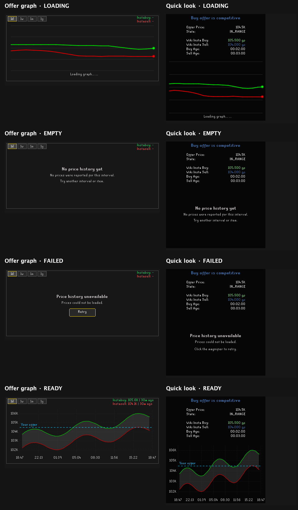

# Price history states

The offer graph and quick-look tooltip distinguish loading, usable prices, no reported prices, and a failed request. A failed offer graph has a **Retry** button. A failed quick-look tooltip asks the player to click its magnifier to retry without leaving the slot. History is empty when no priced samples fall within the selected period, even if the API returns older trades. The chart and status use the same period check, including when the last visible sample ages out. Empty histories stay cached until the normal expiry; they do not trigger another request each frame.

These previews render the actual `OfferGraphChartOverlay` and `QuickLookTooltip`, with fixed example prices and controlled HTTP and RuneLite boundaries. They do not connect to a game account or the wiki API. The loaded overlay also demonstrates time labels and hover bounds following its requested size instead of the chart's default size.

`src/test/java/com/flippingutilities/ui/widgets/ChartStateFixtures.java` provides `overlay(GraphLoadState)` and `tooltip(GraphLoadState)` as Swing components for a native component gallery. The failed overlay preview's Retry button changes to loading and then displays example prices. Repaint timers stop when the component is removed.

Run `ChartStateFixtures.main` from an IDE using the project's test runtime classpath to export eight PNGs and this contact sheet. The default destination is `build/price-history-previews`; an optional first argument selects another directory. Headless rendering is supported.

The fixtures verify layout and controlled interactions. They do not replace an in-game check of widget placement or mouse handling.
